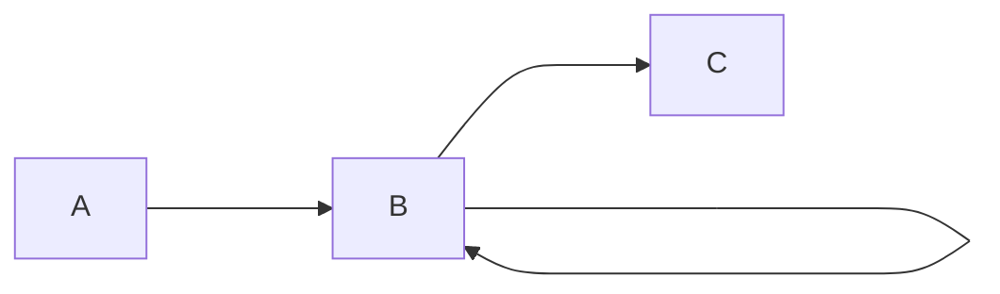
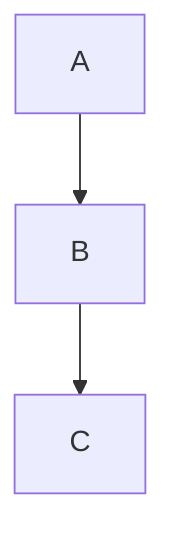

# Diagramas com mermaid plugin

Em alguns contextos, queremos usar diagramas para visualizar de uma forma mais didática o que está acontecendo em um código.  
  
Para isso usa-se o plugin mkdocs-mermaid2, o plugin deve ser instalado junto com as outras dependências do mkdocs. Depois deve ser incluído no arquivo ```yml``` na parte de ```plugins```.  

> Vale ressaltar que ao criar os plugins, os outros plugins padrão do mkdocs devem vir incluídos como o search.
  
## Sintaxe  

Para criar um diagrama, basta definir um fenced-code-block logo e colocar no topo 'mermaid', isso significa que está sendo definida um código em linguagem mermaid. Por exemplo:  

    ```mermaid
    flowchart LR
        A ---> B
        B ---> B
        B ---> C
    ```
Resultado:  



Logo em seguida, especificamos o tipo de diagrama que será utilizado, cada diagrama tem sua sintaxe específica. O ```flowchart``` é um exemplo.  

## FlowChart (gráfico de fluxo)
  
Para gerar um flowchart, basta colocar ```flowchart``` ou ```graph```, por padrão ele irá definir um gráfico de fluxo de cima para baixo.

    ```mermaid
    flowchart
        A --> B
        B --> C

    ```



