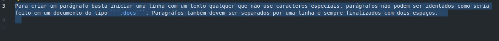

# Paragráfos e enfatização de texto  
  
## Paragráfos  
  
Para criar um parágrafo basta iniciar uma linha com um texto qualquer que não use caracteres especiais, parágrafos não podem ser identados como seria feito em um documento do tipo ```.docs```. Paragráfos também devem ser separados por uma linha e sempre finalizados com dois espaços. Segue um exemplo do próprio texto usado para criar o site:
  
  
  
## Enfatizações  
  
Para enfatizar um trecho ou palavra específica com itálico ou negrito, usa-se * no início e fim e ** igualmente para os dois, respectivamente exemplos:  
  
| ENTRADA (md) | SAÍDA (html) |  
| -------- | -------|  
| \*texto\* | *texto* |  
| \*\*texto\*\* | **texto** |  
| \*\*\*texto\*\*\* | ***texto*** |  
  
> vale ressaltar que ao colocar dois espaços no final de um parágrafo é como se estivessemos colocando uma tag ```<br>``` html.